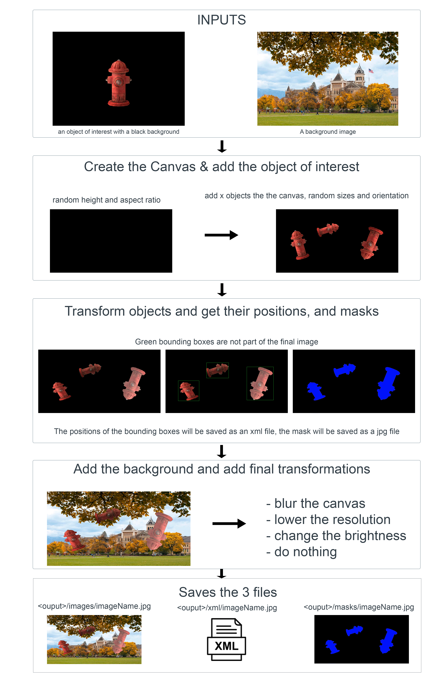

# HyperAugment

*Note: this is a project I developed in my own free time, it is not perfect and still needs some work, I only tested it on Arch Linux and I cannot confirm it will work for all other systems yet. much love, Andrew <3*

## Navigation

[Developer docs (not yet written)](./docs/dev.md)

## Description

**What is HyperAugment**

HyperAugment is an image data augmentation algorithm, meaning you give it a dataset of images and it will multipply and diversify the images in the dataset. The method that HyperAugment uses to augment images is highly experimental, it has show promising results in plant identification tasks but much still needs to be understood of how models trained on data augmented by HyperAugment behave.

**Why it was created**

Hyper augment is meant to be used my machines not by humans, the idea is that if a robot can segment out an object of interest, either using color or a semantic segmentaion model, then the segmented images can be fed to HyperAugment to generate a large dataset persenting the object in many different environments, and the robot can use this dataset to learn to recognize an object on the spot.

**How does it work**

*refer to the developer docs for more details*

HyperAugment follows this basic diagram:




## Getting Started

### Building the source code

- clone the repo: `git@github.com:andrewjouffray/HyperAugment.git`
- Download and install OpenCV for c++
- install C++ 17
- install CMake
- install make 
- in the repo directory, create a build directory `mkdir build`
- `cd build`
- `cmake ../`
- `make`

The output file will be `hyper_a`

### Organizing your data 

- The first important step is to have your input data split into each label that you want to train your model to recognize.
- Then you want to have all the input data images be compiled as .avi video files.
- Put the compiled input videos into directories that match the label (put a video with cars in it, into a directory named "cars")
- You need a large amount of background images saved as .jpg files in a directory of your choice
- Make a working directory and place your input directories in a "input" sub directory, create an output sub directory as well

This is what the working directoy should look like after all these steps:

```

__background_images/
|__background1.jpg
|__bacgrounnd2.jpg
|__background3.jpg
|__background...

__<datasetName>/
|__inputs/
|   |_planes/
|   |   |_planesVideo.avi
|   |
|   |_cars/
|   |   |_carsVideo.avi
|   |   |_anothervideo.avi
|   |
|   |_boats/
|      |_coolBoats.avi
|
|__outputs/

```
I usually have about 20,000 random images in my background directory, usually video frames from random youtube videos.

**Make sure the background images do have the object you want to recognize in them. No cars in the background images of a model trying to learn to recognize cars!**

### Configure the datat augmentation

Hyper Augment uses .yeet files to get configured, The yeet file must be placed in the `input` directory

```

__background_images/
|__background1.jpg
|__bacgrounnd2.jpg
|__background3.jpg
|__background...

__<datasetName>/
|__inputs/
|   |_dataset_config.yeet <---------- YEET
|   |_planes/
|   |   |_planesVideo.avi
|   |
|   |_cars/
|   |   |_carsVideo.avi
|   |   |_anothervideo.avi
|   |
|   |_boats/
|      |_coolBoats.avi
|
|__outputs/

```


here is a sample yeet file you can use:

```
// IMPORTANT: no spaces between the " = " characters, spaces in dataset names are ok

dataset_name=test1

output_path=<path to your dataset dir>/outputs/

background_<path to your background files>

max_objects_per_canvas=5

canvases_per_frame=10

// chances of modifications on the canvas in %

canvas_lower_resolution=15

canvas_blurr=15

canvas_change_brightness=30


// chances of modification on the object of interest in %

object_saturation=40

object_affine_transform=30

```
### Augment your data


In the build directory run:

`./hyper_a -run <path to the yeet file>`

and there you go, it will find the output directory you configured and will create 3 directories `images/` `xml/` and `masks/` and save all the augmented data there!

**The xml files are in the same format as labelImg so they are plug and play with Tensoflow Object Detection API**

## Thanks

This project has been in the works for a long time and many people helped me along the way:

Andrew Williams

Sofiane Mokhtari

Kimball Storey

Joshua Smith

