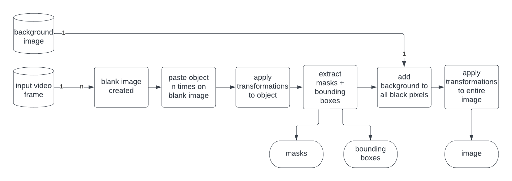
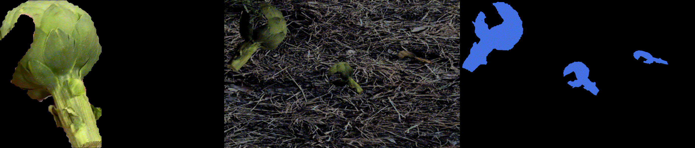

# Composite Image Generator

Semi-synthethic image generation and annotation platform for object detection.

*Note: This is a project I developed in my own free time, it is not perfect and still needs some work, I only tested it on Arch Linux and I cannot confirm it will work for all other systems yet. much love, Andrew <3*


## Project Description

**Semi-synthetic image data generation**

The term semi-synthetic data generation describes image data that is generated by composing and transforming real images of objects together. This method of generating data is sometimes called "copy and paste" because it copies and pastes images on top of a background. 

**Why it was created**

The CIG is ultimately meant to be used by robots, the idea is that if a robot can segment out an object of interest, either using color or a semantic segmentation model, then the segmented images can be fed to the CIG to generate a large dataset presenting the object of interest in many different environments, and the robot can use this dataset to learn to recognize an object on the spot.


**How does it work?**




## Support this project

This is the sister project to [Salient Extract](https://github.com/andrewjouffray/salient-extract), you can support it through the Patreon at [patreon.com/SalientExtractAi](https://patreon.com/SalientExtractAi). Your support would mean the world to me, and will help these projects stay afloat. 
## Getting Started


### Requirements:

- docker
- docker-compose 
- Input videos with a black background see [Salient Extract](https://github.com/andrewjouffray/salient-extract)


### Organizing your data 


1 - Create a working directory

    mkdir myWorkdir/ 

2 - create input / output directories and background

    mkdir inputs/ 
    mkdir outputs/ 
    mkdir backgrounds/ 

3 - Add your data

- Split input videos into class.
- For each class, create a directory in `inputs/` with name matching the class, add the video files to their respective directories. 
- You need a large amount of background images files in your `backgrounds/` directory

This is an example of what a working directory could look like:

```
myWorkdir/
|
|__background_images/
| |__background1.jpg
| |__bacgrounnd2.jpg
| |__background3.jpg
| |__background...
|
|__inputs/
| |_planes/
| | |_planesVideo.avi
| |
| |_cars/
| | |_carsVideo.avi
| | |_anothervideo.mp4
| |
| |_boats/
|   |_coolBoats.avi
|
|__outputs/
  |_<cig will generate stuff here>

```
4 - Configure the CIG

The CIG mounts your workdir to itself to access all your data, therefore, there is a tiny bit of configuration required. Here is a sample of a docker-compose yaml config file for the CIG:

**Do not forget to edit the part between <>**

```
version: '3'

services:  

  cig:
    image: andrewjouffray/composite_image_generator:stable
    restart: "no"

    # define all the image generation settings 
    environment:

      # define where to find the input data relative to your workdir
      - input_path=raw_input_data/

      - dataset_name="inputs"

      - output_path=outputs/

      - background_path=backgrounds/

      # define how to generate the images

      # What is the maximum amout of times that an object can be copied onto an image.
      - max_objects_per_canvas=5

      # for each input frames, how many images should the CIG generate
      - canvases_per_frame=2

      # 10% chance of lowering the resolution of the image
      - canvas_lower_resolution=10

      # 10% chance of blurring the image
      - canvas_blurr=10

      # 30% chance of randomly changing the brightness of the image
      - canvas_change_brightness=30

      # 20% chance of randomly changing the saturation of the object of interest
      - object_saturation=20

      # 50% chance of randomly applying an affine transformation to the object of interest
      - object_affine_transform=50

      # define in what format to save the output
      - save_box_yolo=true

      - save_box_PASCALVOC=true

      - save_masks_json=true

      - save_masks_yolo=true

      - save_masks_png=true
    
    # mount your workdir, do not forget to replace the path in <>
    volumes:
    - <path to your workidr>:/workdir

    # don't touch this
    command: bash -c "cd /code/ && pwd && ls -l && ./start.sh"

```

save this in a yaml file of your choice, in this case I will use `cig_docker_config.yml`


### Generate your data

(make sure you can run Docker without sudo)

    docker-compose -f cig_docker_config.yml up

## Supported  output annotation format

- PASCAL VOC bounding box
- Yolov8 bounding box
- Yolov8 masks
- Labelme json masks
- PNG masks


## Thanks

This project has been in the works for a long time and many people helped me along the way:

Andrew Williams

Sofiane Mokhtari

Kimball Storey

Joshua Smith

